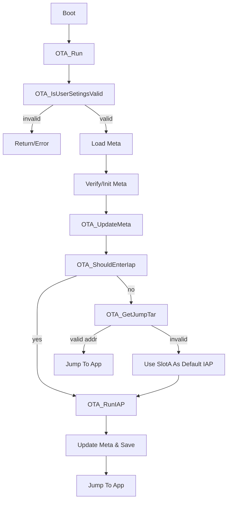

## 目标

- **统一 Flash 抽象**：在 `Core` 层通过 `MiniOTA_FlashLayout` 抽象 Flash 扇区/页布局，屏蔽 F1/F4 乃至其他 MCU 在分区/擦除粒度上的差异。
- **保留旧逻辑兼容性**：保持 F1 示例 `Stm32f103c8t6` 现有按页逻辑基本不变，仅通过新抽象层自动推导布局（自动模式）。
- **支持 F411 非均匀扇区**：为 `Stm32f411ceu6` 提供基于最后 128K 扇区作为缓冲区的升级方案（手动模式），完成 `OtaPort.c`、`OtaInterface.h`、`OtaFlash` 的适配。
- **模式选择清晰**：提供“自动/手动”两种配置方式：自动适配均匀页 Flash，手动模式下由用户指定 APP 区/缓冲扇区等参数。

## 现状梳理

- **逻辑层**：
  - `Core/ota_src/OtaCore.c` 和 `Examples/Stm32f103c8t6/MiniOTA/ota_src/OtaCore.c` 逻辑基本一致，依赖：
    - 分区宏：`OTA_META_ADDR`、`OTA_APP_A_ADDR`、`OTA_APP_B_ADDR`、`OTA_APP_SLOT_SIZE`（在 `OtaInterface.h` 或 `OtaUtils.h` 中定义）。
    - Flash 操作接口：`OTA_FlashHandleInit` / `OTA_FlashWrite`（在 [`Core/ota_src/OtaFlash.c`](Core/ota_src/OtaFlash.c) 中实现）。
    - 端口接口：`OTA_ShouldEnterIap`、`OTA_DebugSend`、`OTA_SendByte` 等（在 OtaPort 层实现）。
- **传输层**：
  - [`Core/ota_src/OtaXmodem.c`](Core/ota_src/OtaXmodem.c) 只关心“当前页缓冲 + 偏移”：
    - 每收满一个小包，写入 `OTA_FlashGetMirr()` 当前页镜像。
    - 当 `OTA_FLASH_PAGE_SIZE - page_offset < data_len` 或传输结束时，调用 `OTA_FlashWrite()` 一次，完成“擦除 + 写整页 + 校验 + 地址推进”。
- **Flash 抽象初稿**：
  - [`Core/ota_src/OtaFlash.h`](Core/ota_src/OtaFlash.h) / [`Core/ota_src/OtaFlash.c`](Core/ota_src/OtaFlash.c) 定义了：
    - `OTA_FLASH_HANDLE`：`curr_addr` + `page_offset` + `page_buf[OTA_FLASH_PAGE_SIZE]`。
    - `OTA_FlashHandleInit(addr)`：设置起始地址并预读一页。
    - `OTA_FlashWrite()`：对当前 `curr_addr` 所在“页”执行：解锁 → 擦除页 → 半字编程整页 → 逐字节校验 → 上锁 → 地址前移一页。
  - Flash 底层适配接口在 [`Core/ota_interface/OtaPort.h`](Core/ota_interface/OtaPort.h) 中定义，由各示例工程的 `ota_src/OtaPort.c` 实现。
- **新抽象的雏形**：
  - [`Core/ota_src/OtaFlashIfoDef.h`](Core/ota_src/OtaFlashIfoDef.h) 定义 `MiniOTA_SectorGroup` / `MiniOTA_FlashLayout`，并约定模板实现 `MiniOTA_GetLayout()`。
  - [`Core/ota_flash_template/stm32f103/stm32f103.h`](Core/ota_flash_template/stm32f103/stm32f103.h)、`stm32f411.h` 等给出了 F1/F4 的扇区分组定义，但：
    - F103 模板 `is_uniform = OTA_FALSE`，实际可视为均匀页；
    - F411 模板把 `is_uniform` 设为 `OTA_TRUE`，但实际是非均匀扇区，且存在语法小问题（缺逗号）。
- **示例工程接口现状**：
  - F1 工程 `Stm32f103c8t6`：
    - `ota_interface/OtaInterface.h` 已完整填写 F1 设备头和简单页布局，逻辑可用。
    - `ota_src/OtaPort.c` 已基于 F1 StdPeriph 完整实现：`FLASH_ClearFlag(FLASH_FLAG_EOP | FLASH_FLAG_PGERR | FLASH_FLAG_WRPRTERR)`、`FLASH_ErasePage` 等。
  - F4 工程 `Stm32f411ceu6`：
    - `ota_interface/OtaInterface.h` 已指向 `stm32f4xx.h`，但仍沿用 F1 的“按页均匀”宏；
    - `ota_src/OtaPort.c` 目前只是空壳，直接复制了 F1 结构但未填内容，且：
      - `FLASH_ClearFlag` 的标志位需改为 F4 的 `FLASH_FLAG_EOP` / `FLASH_FLAG_OPERR` / `FLASH_FLAG_WRPERR` 等；
      - F4 无 `FLASH_ErasePage`，应使用 `FLASH_EraseSector` 或等效寄存器操作，且擦除单元是扇区。 

## 拟定的 Flash 抽象与模式设计

### 1. Flash 布局抽象统一

- **布局结构复用**：继续使用 `MiniOTA_FlashLayout`：
  - `start_addr`：Flash 起始地址（通常为 0x08000000）。
  - `total_size`：整个 Flash 大小（如 F103C8 为 64KB，F411CEU6 为 512KB）。
  - `is_uniform`：
    - `OTA_TRUE`：可以视为“按固定页大小均匀分布”，适合自动模式；
    - `OTA_FALSE`：非均匀扇区，需要手动指定缓冲区与 APP Slot。
  - `group_count` + `groups[]`：描述从低地址到高地址的一系列“扇区组（扇区数量 + 单扇区大小）”。
- **模板修正方案**：
  - F103 模板：
    - 根据实际芯片容量，把 `F103Ser` 和 `group_count` 调整为与真实容量匹配；
    - 若考虑“页等于擦除单位”，可以设置 `is_uniform = OTA_TRUE`，简化自动模式判断。
  - F411 模板：
    - 修复语法错误，在 `group_count` 行补逗号；
    - 将 `is_uniform` 改为 `OTA_FALSE`，明确为非均匀扇区；
    - 保持 `F411Ser` 为 `4x16K + 1x64K + 3x128K` 的分组信息。

### 2. 自动模式（针对按页均匀分区）

- **启用条件**：
  - `MiniOTA_GetLayout()->is_uniform == OTA_TRUE`，或者在 `OtaInterface.h` 中提供宏 `#define OTA_FLASH_MODE_AUTO 1`，默认启用。
- **行为特征**：
  - 页大小直接使用 `OTA_FLASH_PAGE_SIZE`，擦除单位与写逻辑保持一页对应一次 `OTA_ErasePage(curr_addr)`；
  - `OTA_APP_REGION_ADDR`、`OTA_APP_SLOT_SIZE` 等仍按现有宏计算；
  - `OTA_FlashHandleInit` 和 `OTA_FlashWrite` 无需感知扇区组细节，仅在初始化时检查：
    - `OTA_TOTAL_START_ADDRESS`、`OTA_APP_A_ADDR`、`OTA_APP_B_ADDR` 必须落在 `MiniOTA_FlashLayout` 描述的范围内；
    - `OTA_APP_SLOT_SIZE` 必须是 `OTA_FLASH_PAGE_SIZE` 的整数倍。
- **F1 示例使用**：
  - F1 默认走自动模式，因此原有逻辑 100% 保留，只额外增加一些布局一致性检查日志。

### 3. 手动模式（针对非均匀扇区，如 F411）

- **配置宏设计**：在 F4 的 `ota_interface/OtaInterface.h` 或单独的配置头中增加：
  - `#define OTA_FLASH_MODE_AUTO    0`
  - `#define OTA_FLASH_MODE_MANUAL  1`
  - `#define OTA_FLASH_MODE         OTA_FLASH_MODE_MANUAL`
  - 手动模式专用参数（用户按芯片数据手册配置）：
    - `OTA_BUFFER_SECTOR_START`：作为“扇区缓冲区”的物理起始地址（如 F411 的 Sector7：0x08060000）。
    - `OTA_BUFFER_SECTOR_SIZE`：缓冲扇区大小（F411 为 128K）。
    - `OTA_APP_REGION_ADDR` / `OTA_APP_REGION_SIZE`：App 区间一定不与缓冲扇区重叠；
    - 若需要按扇区对齐 APP Slot，可再增加：`OTA_APP_SLOT_SECTOR_COUNT` 或直接通过 `MiniOTA_FlashLayout` 计算。
- **逻辑行为**：
  - 对 Xmodem 层保持接口不变，仍然是“页级 R-M-W”，但页的擦除实现要做成“分扇区、借缓冲区”的算法。
  - 需要在 `OtaFlash.c` 中扩展：
    - **辅助函数**（仅在手动模式下启用）：
      - `static const MiniOTA_FlashLayout* layout = MiniOTA_GetLayout();`
      - `MiniOTA_LocateSector(addr, &sector_start, &sector_size)`：沿 `groups[]` 从 `start_addr` 向上累加，当 `addr` 落在 `[curr_start, curr_start+sector_size)` 时返回该扇区信息。
      - `MiniOTA_IsInBuffer(addr)`：判断地址是否落在缓冲扇区范围，防止误擦除。
    - **新的句柄字段**：
      - 在 `OTA_FLASH_HANDLE` 中增加当前扇区信息（如 `sector_start`、`sector_size`、`sector_offset`），以便跨页处理扇区边界。

## 非均匀扇区写入算法设计（手动模式核心）

### 1. 总体思路（基于单扇区缓冲）

以 F411 为例，假设：

- APP 区间使用从某个扇区开始到倒数第二个 128K 扇区结束；
- 最后一个 128K 扇区作为缓冲 `BUFFER_SECTOR`；
- OTA 升级时，每次只处理 APP 区的一个扇区：

**扇区级流程伪代码：**

```c
for each sector S in APP region, in ascending order:
    // 1. 将原始扇区 S 整个拷贝到缓冲扇区 B
    copy_sector(src_start = S.start, dst_start = BUFFER_SECTOR_START, size = S.size)

    // 2. 擦除原扇区 S
    FLASH_EraseSector(S.index, VoltageRange)

    // 3. 在 Xmodem 数据到来时，按页修改并回写到“原扇区 S”
    //    - 页缓冲 RAM 大小仍为 OTA_FLASH_PAGE_SIZE（如 1K）
    while (this sector still has unwritten pages)
    {
        // 3.1 从缓冲扇区 B 对应位置读出一页到 RAM page_buf
        read_flash(BUFFER_SECTOR_START + page_offset, page_buf, OTA_FLASH_PAGE_SIZE);

        // 3.2 将 Xmodem 小包数据打补丁到 page_buf 内对应偏移
        patch_page_buf_by_xmodem(page_buf, incoming_data);

        // 3.3 将修改后的 page_buf 编程回原扇区 S 对应位置
        program_page_to_flash(S.start + page_offset, page_buf, OTA_FLASH_PAGE_SIZE);

        // 3.4 page_offset += OTA_FLASH_PAGE_SIZE;
    }
```

在实现上：

- Xmodem 仍以“写满一页 → 调用 `OTA_FlashWrite()`”的节奏推进；
- `OTA_FlashWrite()` 在手动模式下不再简单“擦页”，而是：
  - 根据 `flash.curr_addr` 得到当前扇区 `S`；
  - 在进入新扇区时，触发一次：`copy_sector_to_buffer(S)` + `erase_sector(S)`；
  - 写整页时，数据目标始终是“原扇区 S 的地址”；
  - 页缓冲初始内容来自“缓冲扇区 B 对应位置”的拷贝（`OTA_FlashHandleInit` 里根据 `MiniOTA_LocateSector` 做；跨页时更新 `curr_addr`、`page_offset` 并在必要时重新从缓冲扇区读入）。

### 2. 与现有句柄/接口的融合

- 在自动模式：
  - `OTA_FlashHandleInit(addr)`：保持现在的实现：
    - `flash.curr_addr = addr; flash.page_offset = 0; OTA_DrvRead(addr, page_buf, OTA_FLASH_PAGE_SIZE);`
  - `OTA_FlashWrite()`：仍是“解锁→`OTA_ErasePage(curr_addr)`→半字编程整页→校验→上锁→`curr_addr += OTA_FLASH_PAGE_SIZE`”。
- 在手动模式：
  - `OTA_FlashHandleInit(addr)`：
    - 通过 `MiniOTA_LocateSector(addr)`，记录当前扇区 `S`，若首次进入该扇区：
      - 将 `S` 拷贝到缓冲扇区；
      - 擦除 `S`；
    - 从“缓冲扇区 B 对应位置”预读一页到 `page_buf`。
  - `OTA_FlashWrite()`：
    - 不再调用 `OTA_ErasePage`；扇区在进入时一次性擦除即可；
    - 写整页时直接对原扇区地址 `S.start + page_in_sector_offset` 进行半字编程；
    - 校验依然可用“读回并比对”方式；
    - 当 `curr_addr` 跨出当前扇区范围时，再进入下一个扇区重复上述流程。

> 这样，自动/手动模式对外都仍然暴露相同的 `OTA_FlashHandleInit` / `OTA_FlashWrite` / `OTA_FlashGetMirr` / `OTA_FlashSetPageOffset` 接口，逻辑层和 Xmodem 层无需改动。

## F1 / F4 端口层接口设计要点

### 1. 通用端口接口（OtaPort）

- 对 `OtaPort.h` 保持现有接口集合不变，确保逻辑层能统一调用：
  - Boot 入口判断：`OTA_ShouldEnterIap()`。
  - 串口适配：`OTA_ReceiveTask`（在各工程中由中断调用）、`OTA_SendByte`、`OTA_DebugSend`。
  - Flash 适配：`OTA_FlashUnlock`、`OTA_FlashLock`、`OTA_ErasePage`、`OTA_DrvProgramHalfword`、`OTA_DrvRead`。
  - 其他：`OTA_PeripheralsDeInit`、`OTA_Delay1ms`。

### 2. F1（Stm32f103c8t6）端口实现

- 继续使用现有 `ota_src/OtaPort.c` 实现：
  - `OTA_FlashUnlock`：`FLASH_Unlock()` + `FLASH_ClearFlag(FLASH_FLAG_EOP | FLASH_FLAG_PGERR | FLASH_FLAG_WRPRTERR)`。
  - `OTA_ErasePage(addr)`：直接调用 `FLASH_ErasePage(addr)`。
  - `OTA_DrvProgramHalfword`：`FLASH_ProgramHalfWord(addr, data)`。
  - `OTA_DrvRead`：直接 `OTA_MemCopy` 从 Flash 地址拷贝到 RAM。
- 小幅清理工作：
  - 如需要，也可以让 F1 的 `OtaInterface.h` 通过 `#include "Core/ota_flash_template/stm32f103/stm32f103.h"` 或类似路径，引入布局模板中的 `MiniOTA_GetLayout()`，并在启动时通过 `MiniOTA_GetLayout()` 校验 `OTA_FLASH_SIZE` 等配置保持一致。

### 3. F4（Stm32f411ceu6）端口实现

- **FLASH 标志位处理**：
  - 在 `ota_src/OtaPort.c` 中实现：
    - `OTA_FlashUnlock`：
      - 对 F4 可调用 `FLASH_Unlock()` 或 HAL 的 `HAL_FLASH_Unlock()`，然后清除错误与完成标志：
        - 对于标准外设库：`FLASH_ClearFlag(FLASH_FLAG_EOP | FLASH_FLAG_OPERR | FLASH_FLAG_WRPERR | FLASH_FLAG_PGAERR | FLASH_FLAG_PGPERR | FLASH_FLAG_PGSERR);`
      - 返回 0 表示成功。
    - `OTA_FlashLock`：调用 `FLASH_Lock()` 或 `HAL_FLASH_Lock()` 后返回 0。
- **扇区擦除接口 `OTA_ErasePage` 的 F4 映射**：
  - 根据 `addr` 通过与 F411 布局模板中同样的扇区划分（Sector0..7）确定 `sector_index`；
  - 内部调用：`FLASH_EraseSector(sector_index, VoltageRange_3)`（或寄存器方式），返回值转换为 0/1；
  - 自动模式下的 `OTA_ErasePage` 可以简单地映射到“擦除所含扇区”，但手动模式中推荐仅在“进入新扇区”时由 `OtaFlash.c` 内部调用一次，不在每页写入时重复调用。
- **最小可运行 main.c 适配**：
  - 提供 F4 示例最小启动逻辑：
    - 初始化系统时钟、串口1/2 和用于 IAP 按键的 GPIO；
    - 调用 `OTA_Run();` 后若返回则可以进入一个简单的死循环或再次尝试。

## 自动 / 手动模式配置接口设计

- 在 `Core` 或公共配置头中增加模式宏：
```c
#define OTA_FLASH_MODE_AUTO      0
#define OTA_FLASH_MODE_MANUAL    1

#ifndef OTA_FLASH_MODE
#define OTA_FLASH_MODE OTA_FLASH_MODE_AUTO
#endif
```

- 在 F1 和 F4 的工程配置中分别设置：
  - F1：`#define OTA_FLASH_MODE OTA_FLASH_MODE_AUTO`；无需配置缓冲扇区。
  - F4：`#define OTA_FLASH_MODE OTA_FLASH_MODE_MANUAL`，并在 F4 工程自己的配置文件中定义：
    - `OTA_BUFFER_SECTOR_START` / `OTA_BUFFER_SECTOR_SIZE`；
    - 若需要精确控制 APP Slot 对齐，可增加宏如 `OTA_APP_SLOT0_START`、`OTA_APP_SLOT1_START`、`OTA_APP_SLOT_SECTOR_COUNT` 等，对应到 `MiniOTA_FlashLayout` 的扇区索引。

## 示例工程改造步骤（F1 + F4）

1. **完善并修正 Flash 布局模板**：

   - 校对 `ota_flash_template/stm32f103/stm32f103.h` 与芯片手册容量一致，决定是否将 `is_uniform` 设为 `OTA_TRUE`；
   - 修正 `ota_flash_template/stm32f411/stm32f411.h` 语法问题，并将 `is_uniform` 改为 `OTA_FALSE`；
   - 确认 `MiniOTA_GetLayout()` 返回的 `total_size` 与 `OTA_FLASH_SIZE` 一致。

2. **在 Core 层接入布局信息**：

   - 在 `OtaFlash.c` 中引入 `MiniOTA_GetLayout()`，实现 `MiniOTA_LocateSector()` 等辅助函数；
   - 在 `OTA_FlashHandleInit` / `OTA_FlashWrite` 中按 `OTA_FLASH_MODE` 分支实现自动/手动两套流程；
   - 在 `OTA_IsUserSetingsValid` 中可追加：`MiniOTA_GetLayout()` 范围合法性检查和简单日志。

3. **F1 示例工程对齐到新抽象**：

   - 保持 `OtaPort.c` 不变，仅确保 `OtaInterface.h` 中的 `OTA_FLASH_SIZE`、`OTA_FLASH_PAGE_SIZE` 等与 F103 模板一致；
   - 可在 F1 工程链入 `stm32f103.h` 布局模板，使 Core 中的布局检查也生效。

4. **F4 示例工程实现端口层与配置**：

   - 按上述要点实现 `Examples/Stm32f411ceu6/MiniOTA/ota_src/OtaPort.c`：
     - 正确使用 F4 的 Flash 标志位、扇区擦除函数和编程函数；
     - 完成串口发送、调试输出、GPIO IAP 判断、延时等接口；
   - 更新 `Examples/Stm32f411ceu6/MiniOTA/ota_interface/OtaInterface.h`：
     - 保留 CMSIS 设备头 `stm32f4xx.h`；
     - 在合适位置 `#include "Core/ota_flash_template/stm32f411/stm32f411.h"` 或等价路径；
     - 定义 `OTA_FLASH_MODE` 为手动模式，并配置缓冲扇区/APP 区相关宏。

5. **为 F4 实现非均匀扇区写入算法**：

   - 在 `OtaFlash.c` 手动模式分支中：
     - 增加扇区级状态字段和函数，支持“首次进入扇区时拷贝 → 擦除 → 随后按页写回”；
     - 确保 `OTA_FlashWrite()` 被多次调用仍然只在“扇区切换时”触发新的拷贝与擦除；
     - 保证 `OTA_FlashGetMirr` / `OTA_FlashSetPageOffset` 的语义对 Xmodem 层不变。

6. **示例 main.c 与启动逻辑完善**：

   - F1/F4 工程中统一 main 模板：初始化硬件 → 调用 `OTA_Run()` → APP 或 IAP 行为；
   - 确认中断向量表与 BootLoader/App 的链接地址一致（使用 `OTA_APP_A_ADDR + sizeof(OTA_APP_IMG_HEADER_E)` 作为 IOM 地址）。

7. **编译与验证**：

   - 先对 F1 工程编译和在实板上回归测试，确保新抽象不破坏原有功能；
   - 再对 F4 工程编译，解决所有编译错误（尤其是 Flash/串口相关符号）；
   - 在 F4 实板上验证：
     - 正常上电无升级请求时从 active slot 启动；
     - 按键强制 IAP 后能完成一轮 Xmodem 刷写，并正确通过 CRC/Meta 校验；
     - 多次升级后 Meta、APP A/B 切换逻辑正确。

## 简要流程图（逻辑层视角）



## 后续实现顺序建议

1. 先在 Core 层完善 `MiniOTA_FlashLayout` + 自动/手动模式分支，并确保 F1 编译/运行无回归问题；
2. 然后针对 F411 完成 Flash 模板、端口层实现和手动模式算法；
3. 最后统一整理示例工程的 `OtaInterface.h`、`main.c` 和文档注释，标明如何在新平台上移植（选择自动/手动模式、如何配置缓冲扇区与 APP Slot）。